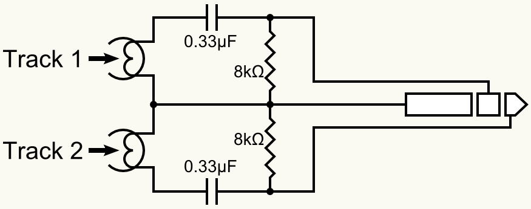

# Magnetic Stripe Reader

A program to decode a magnetic stripe card, receiving the raw data from the magnetic stripe via the sound card.

The general idea is to have a set of magnetic read heads connected to the computer's sound card via the microphone socket. This program then listens on the microphone input, detects the pulses coming from the read heads, and decodes them to reveal the data stored in the magstripe card.

For more information on how it works and how that data is stored, read [my blog post about magnetic stripe cards](http://jacobo.tarrio.org/know/how-magnetic-stripe-cards-work).

This program was written in C# on Visual Studio Community 2013, with the NAudio library.

## Hardware

You'll need to build some hardware to use this program. You'll need the cheapest magstripe reader you can find, a couple of resistors and capacitors (minimum values in the diagram below), and a 3.5 mm microphone jack. Your computer must have a stereo microphone socket.

The general idea is to connect the read heads for track 1 and 2 to the right and left channel in the microphone jack, respectively. One of the leads in each read head is connected to the jack's sleeve; the other lead of track 1 is connected to the sleeve, and the other lead of track 2 is connected to the tip.

There will be a potential difference of 3-5 volt between the sleeve and the ring, and also between the sleeve and the tip. To avoid turning the read heads into electromagnets, I've included a high-pass filter in the circuit. I'm no electrical engineer, but you probably can and should use higher values for the capacitors.

If you want, you can also connect the leads directly to the jack, with no filter, but beware: some of your cards may get erased, and there may be some noise in the signal coming from the read heads.

To verify that you've made the proper connections, open a sound recording program, start recording on the microphone, and swipe the card. When you play it back, you should hear a short tone.

## Using the program

When you start the program, you'll see a pair of "start" and "stop" buttons, a drop-down box to select the audio input device, a button to read a mono WAV file, and a button to clear the display. Underneath, you'll see two boxes where the contents of the cards you swipe will appear.

To use the program, select the appropriate sound input device and press "start". Swipe the card and you should see the contents of track 1 appear on the top box and the contents of track 2 on the bottom box. Press "clear" to erase the contents of the boxes. Press "stop" when you want to stop". You can also record a track into a mono WAV file and load it in the program to decode it.

## Troubleshooting

We are working with homemade hardware, so you may need to make some adjustments before it works correctly.

If nothing appears the first time you swipe after you press "start", just swipe again: the gain control didn't have time to adapt the first time.

If you see garbage on both boxes, try swapping the connections for track 1 and 2.

If you see the contents of track 2 correctly but you see all zeros on track 1 (or nothing at all), it's quite likely that you connected track 3 instead of track 1.

